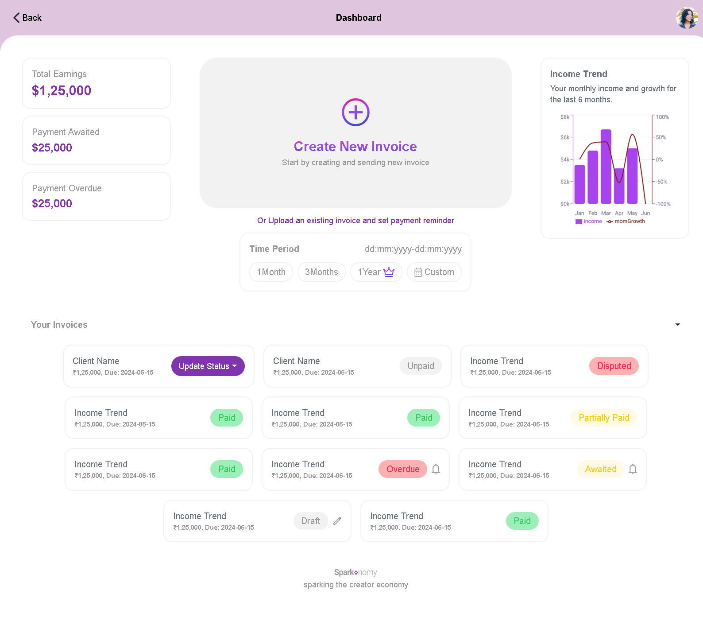

# 💰 Expense Tracker - Frontend Design

This project is a **frontend design implementation** of an Expense Tracker, developed as part of the task given by **Sparknomy**.  
The application is built using **React**, **TypeScript**, and **TailwindCSS**, focusing on clean UI, responsive design, and reusable components.

---

<div style="display: flex; gap: 10px;">
  
  
</div>

---

## 🚀 Tech Stack
- **React** ⚛️ – Component-based UI development
- **TypeScript** 🔹 – Type-safe JavaScript for reliability
- **TailwindCSS** 🎨 – Utility-first CSS framework for styling

---

## 🛠️ Installation & Setup

1. Clone the repository:
   ```bash
   git clone https://github.com/your-username/expense-tracker-frontend.git
2. Navigate to the project folder:
 ```bash
cd expense-tracker-frontend
```

3. Install dependencies:
 ```bash
npm install
```

4. Run the development server:
 ```bash
npm run dev
```

5. Open your browser and visit:
 ```bash
http://localhost:5173
```

---
